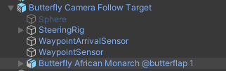

this document uses a Butterfly model from [Bird Flock](http://bit.ly/BirdFlock), this asset has loads of wonderful birds and a script to have them flock. However, we are using it for a simple use case and thus you can use any butterfly or similar model to follow along.

You can see this setup [in action](https://youtu.be/cN0VOPdWLw4). 

This document only describes the additional features used over and above earlier examples. So if you haven't done so already work therough those first, you can find a list in the [Documentation Readme](README.md). 

# Model

All you need to do is add the butterfly model as a child of the `Camera Follow Target` object. Since this model comes with a default flap animation that's all you need to do. In this simple example we don't need to worry about altering the animation based on the flight model. We could do that, and indeed we do using the more comples [Unka the Dragon](unka.md) example. But let's not get ahead of ourselves.

