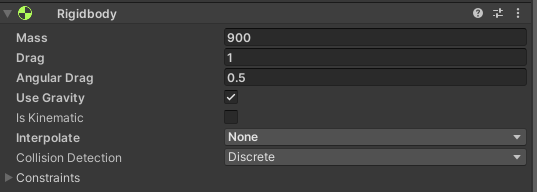
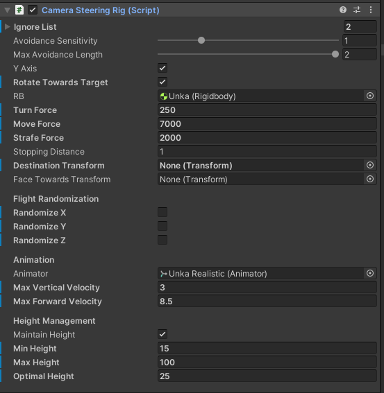

[Unka](https://bit.ly/UnkaTheDragon) is an great dragon model from [Malbers Animations](https://assetstore.unity.com/publishers/16163?aid=1101l866w), in this example we will wire Unka up to the explorer system so that he can fly around our landscape freely. 

You can see this setup [in action](https://www.youtube.com/watch?v=I8OWk5mNUdA). 

This document only describes the additional features used over and above earlier examples. So if you haven't done so already work therough those first, you can find a list in the [Documentation Readme](README.md). 

# Model

As with the [Butterfly](butterfly.md) example the first thing you will need to do after setting up the [basic flight setup](flyCam.md) is add your Unka model. This is easily done, simply drop the model under the root of your `Camera Follow Target` object.

I like to rename the root object, in this case to "Unka".

# Flight Mechanics

The system uses Physics to model the movement of the object, therefore you need to balance a whole range of parameter to get it to look right. We've split them into two sections here. Flight Mechanics, which is the physics section and Animation Controller which is how it looks.

## Rigid Body

Setup your Rigid body for the mass and drag of the body. For Unka we used this setup:

## Steering Rig

The steering rig applies forces to the rigid body. Using these settings you can make flight look effortless or labored. The precise settings will depend on what you are looking for and the values set in the Rigid Body. For this example we used the follwing settings:

# Animation

You can send parameter values from the `Steering Rig` to an animation controller in order to control the animation of your model. The parameters specific to this feature are:

  * Animator - this needs to be set to the Animator who controller you want to work with
  * Max Vertical Velocity - used to normalize the `verticalVelocity` parameter.
  * Max Forward Velocity - used to normalize the `forwardVelocity` parameter

You can see the values we used for Unka in the image above.

## Animation Controller

You will need an animation controller that uses the following parameters which will have a normalized range of -1 to 1 based on the `Max Vertical Velocity` and `Max Forward Velocity` set in the `Steering Rig` (see above).

  * `angularVelocity` - the current rotation speed about the y axis
  * `verticalVelocity` - the current up/down velocity
  * `forwardVelocity` - the current forward/backward velocity. 

How you setup this controller is entirely up to you. We have provided an example for Unka in `Packacges/Wizards Code - Automated Explorer/Animations/Unka Animation Controller`. This uses a blend tree setup and we find it works well. Note, to use it you will have to add the animations into the controller after you have imported Unka.

## Sounds Conroller

The animations in Unka have sound events for wing flaps. We have provided a very simple controller to take advantage of these. At the time of writing this is very simple, should be placed on the Unka model object and configured as follows:

## Waypoint Spawner

There is nothing special to do with the Waypoint Spawner, but do make sure your heights are setup so that the waypoints spwn in an accessible place for the dragon.